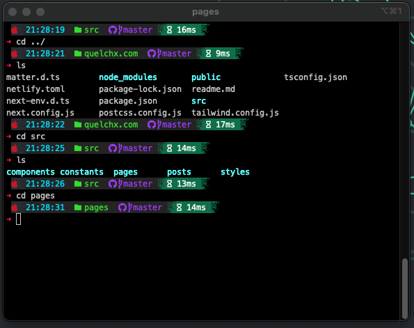

# Oh-My-Posh ZSH Terminal Theme Configuration

**Table of Contents**

- [About](#about-repository)
- [Clone Repository](#copy-this-repository)
- [Fonts](#fonts)
- [Notes](#notes)

## About Repository

Contents of this repository contain my personal theme and configuration for Oh-My-Posh -- a Oh-My-Zsh custom prompt engine for any shell that has the ability to adjust the prompt string with a function or variable.

Inside the config file contains an example .zshrc file and a modified them for Oh-My-Posh.

Follow the Oh-My-Posh documents to install and setup your own custom terminal at https://ohmyposh.dev/docs/.

If you don't have zsh installed check out Oh-My-Zsh at https://github.com/ohmyzsh/ohmyzsh/wiki for more information

## Copy this repository

If you have Oh-My-Posh installed and want to copy this repository run `npx degit quelchx/omp omp` and copy and paste the config contents to your /usr directory. (macOS -- haven't tested this with Windows and WSL or other Linux distrubutions). Or you can simply copy and paste the config/.zshrc and config/7.64.2.omp.json contents to your own respective files.

## Fonts

Fonts have been provided in case various symbols don't work with this configuration. Currently I'm using `Meslo LG M Regular Nerd Font` as my default font. Other fonts may or may not work but have been provided in the fonts directory.

### Notes

**This repository** is intented for personal use. Documentation is provided to educate and act as a backup. Requires a terminal that supports ANCII text. In order to get this to personally work on my iTerm2 terminal I had to use MesloLGM Nerd Font.